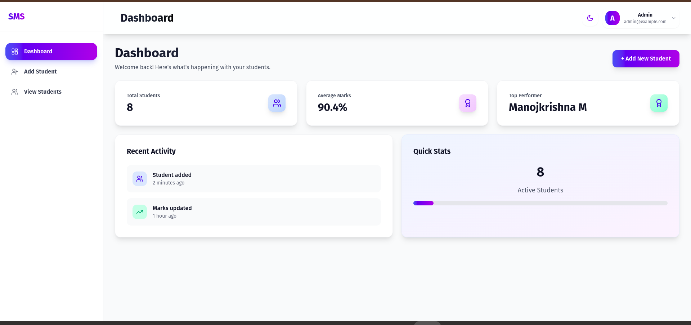

# Student Management System 🏫

**Full-stack web app for admin student record management with authentication, dashboard, and CRUD operations.**


## ✨ Features
- 🔐 JWT-based admin authentication
-  Add students with form validation
-  View students (pagination, search, sort)
-  Update student details
-  Delete students
-  Dashboard with stats (total, average marks)
-  Responsive UI + dark mode (Tailwind)

## 🛠 Tech Stack
| Frontend | Backend | Database |
|----------|---------|----------|
| React + Vite | Flask + SQLAlchemy | MySQL |
| Tailwind CSS | JWT Auth | PyMySQL |
| React Router | REST APIs | |

## 📁 Structure
```
.
├── frontend/     # React + Vite + Tailwind
├── backend/      # Flask API (main.py)
├── README.md
└── .gitignore
```

## 🚀 Quick Start

### Frontend
```bash
cd frontend
npm install
npm run dev
```
[http://localhost:3000](http://localhost:3000)

### Backend
```bash
cd backend
pip install -r requirements.txt
python main.py
```
[http://localhost:5000/api](http://localhost:5000/api)

### Database
```sql
-- backend/migrations/initial.sql
SOURCE backend/migrations/initial.sql;
```

## 🔧 Environment Variables

**frontend/.env**
```
VITE_API_URL=http://localhost:5000/api
```

**backend/.env**
```
DB_HOST=localhost
DB_PORT=3306
DB_NAME=student_db
DB_USER=root
DB_PASSWORD=password
SECRET_KEY=your-secret-key
```

## 📚 API Endpoints
| Method | Endpoint | Description |
|--------|----------|-------------|
| POST | `/api/auth/login` | Admin login |
| GET | `/api/students` | List students |
| POST | `/api/students` | Add student |
| PUT | `/api/students/:id` | Update |
| DELETE | `/api/students/:id` | Delete |

## 📸 DASHBOARD

## [Students](./screenshots/students.png)


**Live Demo:** [https://Manojkrishna27.github.io/Student-Management](https://Manojkrishna27.github.io/Student-Management)

## 🚀 Deployment
**Frontend (GitHub Pages):**
```bash
cd frontend
npm run deploy
```

**Backend (Render):**
- Connect repo
- `pip install -r requirements.txt`
- `python main.py`

## 🔮 Future
- Role-based access
- Student portals
- File uploads
- Charts library
- Testing (Jest/Pytest)

**Author:** [Manojkrishna M](https://github.com/Manojkrishna27) | manojkrishna2725@gmail.com
